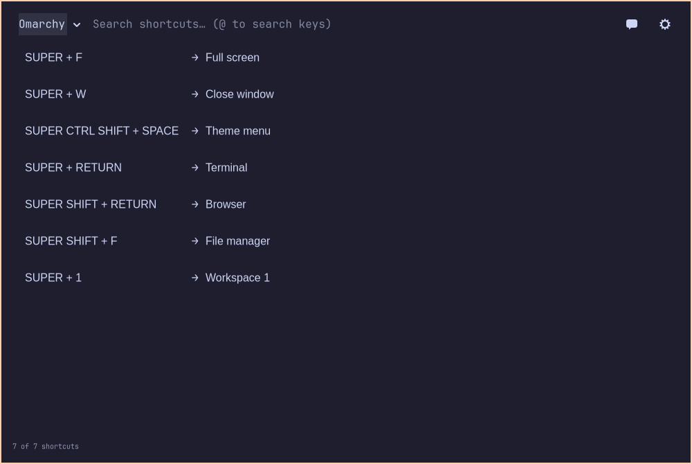

<p align="center"></p>

# Bindlume

**Illuminating your bindings.** Find keyboard shortcuts for your desktop and apps, see their keys light up, and ask an optional agent to help you use and configure the app.

[Website](https://bindlume.aylith.com) · [Testing releases](https://github.com/aylith-labs/bindlume/releases) · [Report a bug](https://github.com/aylith-labs/bindlume/issues/new/choose)



## Public testing preview

Bindlume is ready for **early testing on Omarchy's Lua-based Hyprland desktop**. This is an alpha, not a stable release. Other Linux desktops, Windows, and macOS are not supported testing targets yet. See [known limitations and verification](RELEASE_READINESS.md).

- Search desktop and app shortcuts by action name or key combination.
- Explore a keyboard with highlighted keys, including an optional raised-key appearance.
- Bookmark useful shortcuts, hide others, and import or create custom shortcut sets.
- Follow your desktop colors or choose Square, Rounded, and Neo appearances.
- Use the optional companion with an installed Codex, Claude, Gemini, or OpenCode agent, or configure a direct Gemini, OpenRouter, Ollama, or compatible API connection.
- Let the agent search shortcuts and change Bindlume through its running-app control API.
- Enable the optional modifier-driven keyboard guide, mouse gestures, or controller controls.

## Install on Omarchy

Install the required system packages first (the installer itself runs as your user):

```sh
sudo pacman -S --needed git make python python-gobject python-cairo gtk4 gtk4-layer-shell libxkbcommon jq base-devel

git clone https://github.com/aylith-labs/bindlume.git
cd bindlume
make install
bindlume
```

Omarchy supplies Hyprland, Lua, its shell, and its live shortcut adapter. Use a current Lua-based Omarchy installation. `make install` copies the app to `~/.local/share/bindlume`, adds its launcher, registers the bundled keyboard-guide plugin, and backs up your Hyprland bindings before adding its managed block. The default app shortcut is **Super+Shift+K**; an existing Bindlume hotkey is preserved.

Settings, bookmarks, custom sets, and conversations live under `~/.config/bindlume`. Existing pre-rename data is migrated without overwriting a conflicting destination. Stop the older app before upgrading.

```sh
# Update from your checkout, then restart Bindlume from its menu:
git pull --ff-only
make install

# Uninstall the app while preserving personal data:
make uninstall
```

The guide is optional and starts disabled on a fresh profile. Enabling global input observation requires a separate explicit input-access setup; see the [user guide](docs/USER_GUIDE.md). You can browse and search shortcuts without enabling it.

## Help test it

Try search and keyboard navigation, switching shortcut sets, light/dark appearance, reopening the app, and resizing with the companion open. Report your Omarchy/Hyprland versions, Bindlume revision, steps to reproduce, and expected versus actual behavior. Redact private chats and credentials from screenshots or logs.

[Open a bug report](https://github.com/aylith-labs/bindlume/issues/new/choose) or [start a discussion](https://github.com/aylith-labs/bindlume/discussions).

## Documentation

- [User guide](docs/USER_GUIDE.md)
- [Custom shortcut sets](SHORTCUT_SETS.md)
- [Agent connections and performance](FAST_CHAT.md)
- [Replace the logo](branding/README.md)
- [Testing and known limitations](RELEASE_READINESS.md)
- [Contributing](CONTRIBUTING.md)

## Development

```sh
python app.py
make test
```

GTK tests run on an isolated Broadway display. QML tests need Qt 6 Declarative development tools and the QtQuick/QtTest modules. Tests never inject input into your desktop. Compositor and physical-device behavior still need real hardware testing.

## License and credits

MIT. The bundled keyboard guide derives from [Omarchy Keyguide](https://github.com/mrai125kr/omarchy-keyguide); its license, attribution, and upstream revision are retained in [keyguide/](keyguide/UPSTREAM.md). Bindlume is an independent Aylith project and is not an official Omarchy product.
